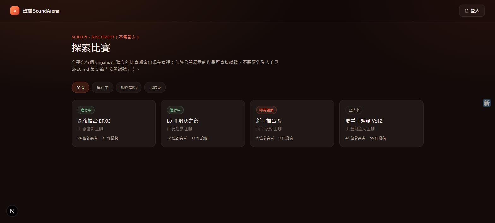
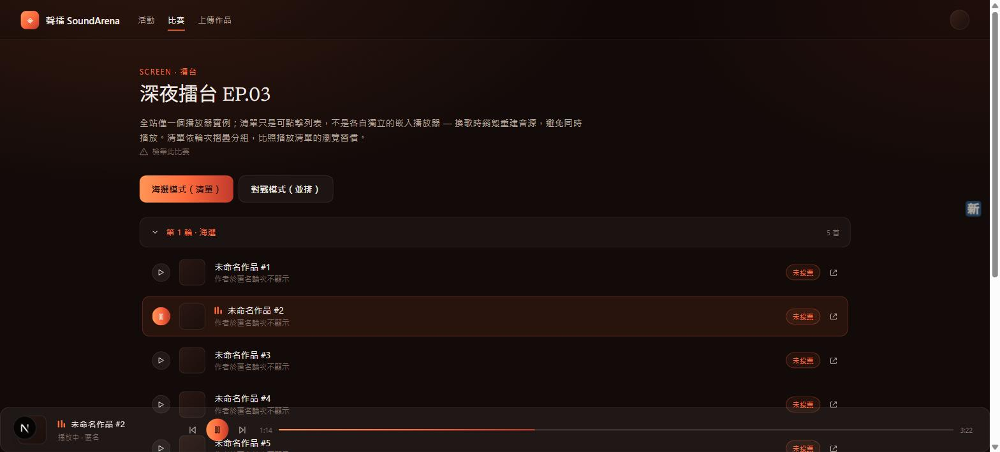
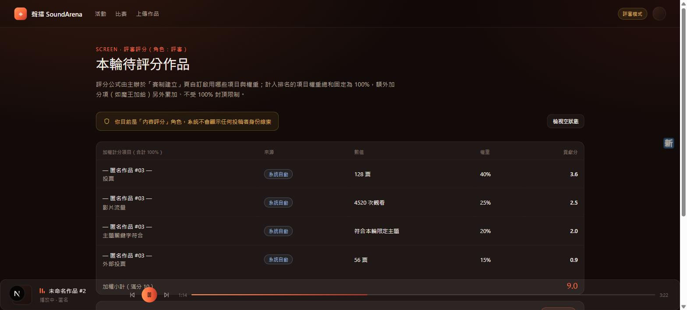
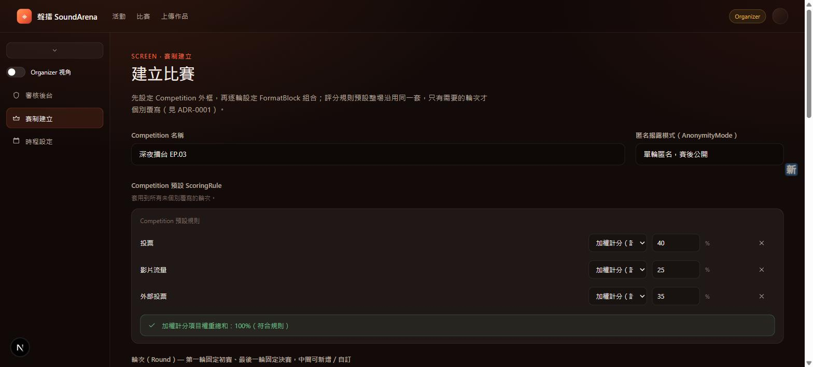

# 聲擂 SoundArena

AI 音樂比賽投票網站——支援 Suno 等 AI 音樂平台的創作者投稿、多輪賽制淘汰、匿名投票。通知事件已有資料模型，實際透過 LINE / Discord bot 送出通知尚未串接寄送服務（見下方「開發狀態」）。

SoundArena 是開放多租戶平台：任何使用者都能申請建立比賽並成為該場比賽的主辦方（Organizer），需要通過平台管理員審核才能開始管理比賽。

## 畫面預覽

| Discovery（比賽發現頁，不需登入） | 擂台（播放清單） |
| --- | --- |
|  |  |

| 評審評分 | 賽制建立 |
| --- | --- |
|  |  |

## 核心功能

- **開放多租戶**：使用者申請並經平台管理員審核通過後可建立/管理自己的比賽；Organizer 可把單場比賽的部分權限（審核投稿、賽制建立、時程設定、評分、邀請協作者）委派給 Collaborator
- **賽制積木系統**：淘汰方式、分組方式、特殊機制可自由組合成每一輪的賽制，不強制整場統一
- **評分機制**：加權計分項目（權重總和固定 100%）+ 額外加分項（不封頂），計算公式對所有人公開透明；評審評「AI 使用方式」（技術新意、創作過程、倫理數據來源、過程透明度）與觀眾投票評「整體吸引力」是兩套獨立的評分項目，一起算進加權總分
- **匿名投票**：Round 層級的匿名開關（是/否），標記匿名的輪次在投票截止前隱藏投稿者身份，投票一截止即公開；匿名階段的投稿清單每次讀取重新隨機排序
- **身份驗證**：投稿連結解析出的 Suno 帳號與報名帳號自動比對，不一致需人工放行
- **播放架構**：投稿者上傳音檔至 Backblaze B2 私有儲存，播放時由後端動態簽發短效期網址，不使用第三方平台的直連網址

完整規格見 [SPEC.md](SPEC.md)，領域詞彙定義見 [CONTEXT.md](CONTEXT.md)，架構決策見 [docs/adr/](docs/adr/)。

## 技術棧

- **前端**：Next.js 16（App Router）+ TypeScript + Tailwind CSS v4，部署於 Vercel
- **後端**：Supabase（Auth + Postgres + Row Level Security）
- **音檔儲存**：Backblaze B2（S3 相容）
- **登入**：Google、Discord（LINE 尚未開通）

## 開發狀態

登入、報名、投稿（含音檔上傳/播放）、投票、評審評分、審核後台、賽制建立、時程設定、Discovery、主辦人審核、協作者委派、音檔留存清理等核心流程已接上真實的 Supabase 讀寫並上線運作，不是假資料。詳細進度、已知限制、下一步見 [HANDOFF.md](HANDOFF.md)；架構決策與資安複查紀錄見 [docs/adr/](docs/adr/)。

## 本地開發

```bash
cd web
npm install
npm run dev
```

需要在 `web/.env.local` 提供 Supabase 專案的 URL 與金鑰（不進版控，見 `web/.gitignore`）。
